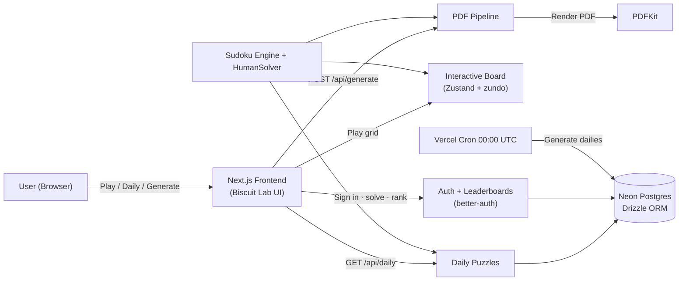
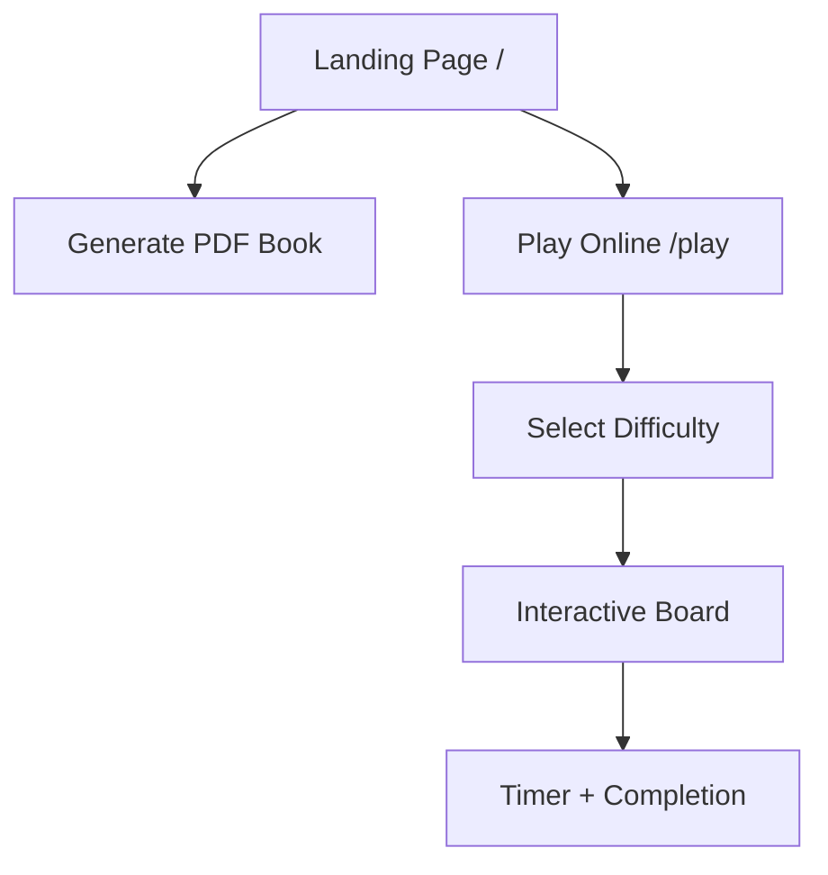
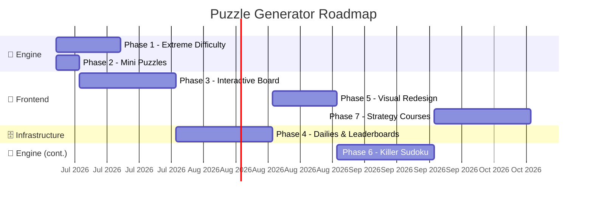
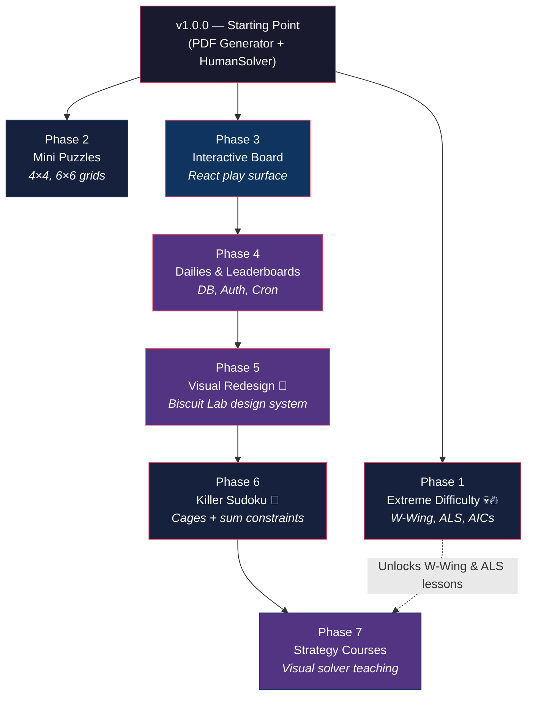

<!-- markdownlint-disable MD060 -->

# Puzzle Generator — Project Roadmap

> From PDF generator to interactive puzzle platform.

---

## Where We Are Today (v3.0.0)



The app is now a **stateful, interactive puzzle platform** deployed at
[puzzles.biscuitlab.net](https://puzzles.biscuitlab.net). It still generates PDF puzzle
books, but it also offers an in-browser board (`/play`), a shared daily puzzle per
difficulty (`/daily`), user accounts (passkeys-first), anti-cheat leaderboards, and
streaks — all backed by Neon Postgres and dressed in the **Biscuit Lab** design system.
The stateless PDF generator is now one entry on the puzzle hub rather than the whole app.

### What's Built

| Layer | Component | Status |
|---|---|---|
| **Engine** | Bitmask + MRV backtracking generator + unique-solution validator | ✅ Shipped |
| **Engine** | `HumanSolver` — Naked/Hidden Singles & Pairs, Pointing Pairs, X-Wing, Swordfish, Y-Wing, XYZ-Wing, W-Wing, ALS-XZ, AICs (bitmask candidates; Basic ~0.11ms / Extreme ~10ms) | ✅ Shipped |
| **API** | `/api/generate` — accepts difficulty counts (including extreme), returns PDF stream | ✅ Shipped |
| **Frontend** | `PuzzleForm` (at `/generate`) — difficulty selectors, Biscuit Lab styling | ✅ Shipped |
| **Frontend** | Interactive board at `/play` — Zustand+zundo store, playable grid, pencil marks, undo/redo, hints, timer, mistakes, persistence | ✅ Shipped |
| **API** | `/api/puzzle` — on-demand single-puzzle JSON for the interactive board | ✅ Shipped |
| **PDF** | `pdf.service.ts` — vector grids, bookmarks, internal links, answer keys | ✅ Shipped |
| **Backend** | Neon Postgres + Drizzle ORM, Vercel Cron daily generation, one shared puzzle/difficulty/day | ✅ Shipped |
| **Auth** | better-auth — passkeys-first, email/password (Argon2id), Google OAuth, DB sessions, BOLA-scoped access | ✅ Shipped |
| **Frontend** | `/daily` + anti-cheat leaderboards + streaks; account UI, ranked solves (server-timed) | ✅ Shipped |
| **Design** | Biscuit Lab design system — tokens + light/dark theme, full restyle, juice layer, chaos chrome, puzzle hub | ✅ Shipped |
| **Testing** | Vitest unit suite (124 tests) + Playwright E2E + benchmark scripts with auto-logging | ✅ Shipped |
| **Infra** | Structured Pino logging (`instrumentation.ts`) + CI security scanning (CodeQL, Dependabot, `npm audit`) | ✅ Shipped |

> **Hardening pass (landed):** a full audit against `AGENTS.md` plus remediation —
> Jest→Vitest migration, an API stack-trace-leak fix, the bitmask/MRV engine rework,
> broad test coverage, and CI. Details in
> [agents-compliance-audit.md](agents-compliance-audit.md).

---

## The Three Tracks

This roadmap is organized into **three parallel tracks** that correspond to the three distinct areas of the codebase. Each phase may touch one or more tracks.

````carousel
### 🧮 Track A — The Math Engine
Expanding the algorithmic solver and generator to support new puzzle types and extreme difficulty levels.

**Key files:**
- [sudoku.ts](../src/features/engine/sudoku.ts)
- [human-solver.ts](../src/features/engine/human-solver.ts)
<!-- slide -->
### 🗄️ Track B — Backend Infrastructure
Introducing state, persistence, authentication, and scheduled jobs. Transforming the app from stateless to stateful.

**New dependencies needed:**
- Database (PostgreSQL via Supabase or Vercel Postgres)
- Auth provider (NextAuth / Auth.js)
- Cron scheduler (Vercel Cron or node-cron)
<!-- slide -->
### 🎨 Track C — Frontend Experience
Building interactive play surfaces, visual strategy courses, and real-time competitive features.

**Key files:**
- [page.tsx](../src/app/page.tsx)
- [PuzzleForm.tsx](../src/features/puzzle-configuration/components/PuzzleForm.tsx)
````

---

## Phase 1 — Extreme Difficulty 💀🔥

> **Tracks:** 🧮 Engine
> **Branch:** `feature/extreme-strategies`
> **Status:** ✅ Done
> **Estimated effort:** Large (1–2 weeks)
> **Prerequisite:** None — this is the next step.

This phase is already designed in the [extreme-implementation-plan.md](archive/extreme-implementation-plan.md). It extends the `HumanSolver` with three elite-tier strategies and adds a new difficulty level to the entire pipeline.

### Deliverables

#### 1.1 — W-Wing Strategy

- Scan for conjugate pairs across all houses
- Cross-reference with matching bivalue cells bridged by the pair
- Eliminations from cells seeing both bivalue endpoints

#### 1.2 — Almost Locked Sets (ALS-XZ → Full ALS Chains)

- Enumerate ALS groups (N cells, N+1 candidates) per house
- Identify Restricted Common Candidates between ALS pairs
- Extend to full ALS Chains (3+ sets threaded together)

> [!WARNING]
> Combinatorial explosion risk: a 9-cell house has 511 possible subsets. Aggressive pruning (only check subsets where `|candidates| = |cells| + 1`) is **mandatory**.

#### 1.3 — Alternating Inference Chains (AICs)

- Build a full inference graph with strong/weak link edges
- Implement BFS/DFS pathfinding with strict alternation constraints
- Support Grouped AICs (cell clusters as single nodes)
- **Max chain depth: 12–16 nodes** to prevent unbounded search

#### 1.4 — Generator Integration

- New `applyExtremeDigger` function targeting 20–22 clues
- `canHumanSolveExtreme(grid)` validator
- UI: skull emoji label 💀🔥, red warning about 60s generation time
- PDF: new section header in outline for Extreme tier

#### Performance Target

| Metric | Target |
|---|---|
| Average generation time per Extreme puzzle | < 10 seconds |
| Solver speed (AIC-heavy boards) | < 2 seconds |
| Existing Expert regression | 0 — all current tests pass |

---

## Phase 2 — Mini Puzzles (4×4, 6×6) (✅ Done)

> **Tracks:** 🧮 Engine, 🎨 Frontend
> **Branch:** `feature/mini-puzzles`
> **Estimated effort:** Medium (3–5 days)
> **Prerequisite:** None — can run in parallel with Phase 1.

This is the **lowest-hanging fruit** for new puzzle variety. The core backtracking and validation logic already works; it just needs to be parameterized.

### Design Decisions (Resolved)

1. **Difficulty Availability:** 4×4 and 6×6 restricted to Easy, Medium, Hard only.
2. **Clue Quotas:**
   - 4×4: Easy=9 givens, Medium=6, Hard=4 (mathematical minimum).
   - 6×6: Easy=20 givens, Medium=16, Hard=10.
3. **PDF Layout:** Mini grids scaled up to fill the same bounding box as 9×9.

### Phase 2 Deliverables

#### 2.1 — Parameterized Engine ✅

- `GridSize` type (4 | 6 | 9) and `GridConfig` interface added to `sudoku.ts`
- All internal functions (`createEmptyGrid`, `isValid`, `fillGrid`, `countSolutions`) accept dynamic `config`
- `HumanSolver` infers `size`, `boxWidth`, `boxHeight` from the grid's length
- All hardcoded `9`s and `27`s replaced with dynamic `this.size` and `this.numHouses`
- Expert/Extreme diggers restricted to 9×9 only

#### 2.2 — Difficulty Calibration ✅

- Dynamic clue quotas implemented via lookup table in `applyQuotaDigger`
- Mini grids only support Easy/Medium/Hard difficulty levels

#### 2.3 — PDF Rendering ✅

- `drawGrid` dynamically infers grid size and draws correct box borders
- All grids (4×4, 6×6, 9×9) scale to fill the same 400px bounding box
- Titles include grid size label for mini puzzles (e.g., "Sudoku #1 (4×4) (easy)")

#### 2.4 — UI Updates ✅

- Grid Size segmented button selector added to `PuzzleForm` (4×4, 6×6, 9×9)
- Expert/Extreme inputs visually disabled (40% opacity) for mini grids
- API validates gridSize parameter and rejects Expert/Extreme for mini grids

---

## Phase 3 — The Interactive Board

> **Tracks:** 🎨 Frontend, 🗄️ Infrastructure
> **Branch:** `feature/interactive-board` (merged to `main`)
> **Status:** ✅ Done (core) — further polish may still be applied
> **Estimated effort:** Large (2–3 weeks)
> **Prerequisite:** None — but Phase 4 and 5 build on top of this.

The playable board shipped at `/play` — 4×4/6×6/9×9, keyboard/mouse/touch input,
pencil marks, undo/redo, hints, real-time errors, number lockout, same-number
highlight, a timer with pause, a mistakes counter, a solved modal, and localStorage
persistence. Full write-up in
[phase3-walkthrough.md](archive/phase3-walkthrough.md).

### Deferred polish (revisit after Phase 4)

These were consciously skipped to ship the core; come back to them:

- [ ] **CSS Subgrid** for cross-cell pencil-mark alignment (currently fixed per-cell
      slots — needs a board-grid restructure).
- [ ] **Mistakes limit / lives** — optionally end the game after N mistakes.
- [ ] **Sound effects** for placement / error / win.
- [ ] **Strategy-aware "why" hints** — name the technique instead of just revealing a
      cell (overlaps Phase 6's solver-step serialization).

This is the **architectural pivot point**. Everything after this phase depends on having a playable, in-browser Sudoku board instead of a PDF-only output.

### Phase 3 Deliverables

#### 3.1 — React Sudoku Board Component

- Full 9×9 interactive grid with keyboard & mouse input
- Candidate pencil-mark mode (toggle per cell)
- Visual highlighting: selected row/column/box, conflicts, locked clues
- Responsive design — works on desktop and tablet
- Smooth micro-animations for number placement and error states

#### 3.2 — Game State Manager

- React context or Zustand store for puzzle state
- Undo/redo stack
- Timer (with pause)
- Completion detection + celebration animation

#### 3.3 — Play Mode vs. PDF Mode

- New route: `/play` for interactive solving
- Existing `/` page continues to offer PDF generation
- Navigation between modes



---

## Phase 4 — Dailies, Users & Leaderboards

> **Tracks:** 🗄️ Infrastructure, 🎨 Frontend
> **Branch:** `feature/daily-leaderboards`
> **Status:** ✅ Done — all slices **4.1–4.4 deployed to production** (`puzzles.biscuitlab.net`) and verified live: DB, daily cron, passkeys-first auth (email/password + Google), BOLA ownership, anti-cheat leaderboards + streaks, and the full UI. Running log: [phase4-walkthrough.md](phase4-walkthrough.md)
> **Estimated effort:** Large (2–3 weeks)
> **Prerequisite:** Phase 3 (Interactive Board)

This phase introduces **state and persistence**. The app goes from stateless to having a database, user accounts, and scheduled puzzle generation. It ships in independently-mergeable slices (4.1 → 4.4); see [phase4-implementation-plan.md](phase4-implementation-plan.md) for the security-first plan and confirmed stack (Neon Postgres · Drizzle · better-auth · Vercel Cron · Upstash).

### Phase 4 Deliverables

#### 4.1 — Database Layer (Secure by Design) ✅ Done

- **PostgreSQL via Neon** (Vercel Marketplace integration), accessed through the Neon HTTP driver for serverless.
- **Drizzle ORM** for type-safe, parameterized queries (no string-built SQL). Schema in [schema.ts](../src/lib/db/schema.ts); server-only client in [client.ts](../src/lib/db/client.ts) (guarded by `server-only`).
- Checked-in SQL migration (`drizzle-kit generate`) under `src/lib/db/migrations`; scripts: `db:generate`, `db:migrate`, `db:studio`, `db:seed`.
- Idempotent local seed ([seed.ts](../src/lib/db/seed.ts)) generating today's dailies; pure row-mapping helpers ([daily-row.ts](../src/lib/db/daily-row.ts)) with unit tests.
- Required env documented in [.env.example](../.env.example). Auth-identity tables (accounts/passkeys/sessions) are deferred to 4.3 (owned by better-auth's adapter).
- Schema design:

```sql
-- Daily puzzles (one per difficulty per day)
CREATE TABLE daily_puzzles (
  id          UUID PRIMARY KEY DEFAULT gen_random_uuid(),
  date        DATE NOT NULL,
  difficulty  TEXT NOT NULL,
  grid        JSONB NOT NULL,      -- the unsolved puzzle
  solution    JSONB NOT NULL,      -- the solved grid
  clue_count  INT NOT NULL,
  created_at  TIMESTAMPTZ DEFAULT now(),
  UNIQUE(date, difficulty)
);

-- User accounts
CREATE TABLE users (
  id          UUID PRIMARY KEY DEFAULT gen_random_uuid(),
  provider    TEXT NOT NULL,       -- 'google', 'github', etc.
  provider_id TEXT NOT NULL,
  username    TEXT UNIQUE NOT NULL,
  password    TEXT,                -- Hashed via Argon2id (if local auth is added)
  created_at  TIMESTAMPTZ DEFAULT now()
);

-- Solve attempts (speed runs)
CREATE TABLE solve_attempts (
  id          UUID PRIMARY KEY DEFAULT gen_random_uuid(),
  user_id     UUID REFERENCES users(id),
  puzzle_id   UUID REFERENCES daily_puzzles(id),
  time_ms     INT NOT NULL,        -- solve time in milliseconds
  completed   BOOLEAN DEFAULT false,
  created_at  TIMESTAMPTZ DEFAULT now(),
  UNIQUE(user_id, puzzle_id)       -- one attempt per user per puzzle
);
```

#### 4.2 — Daily Puzzle Cron ✅ Done

- **Vercel Cron** ([vercel.json](../vercel.json)) hits [`/api/cron/daily`](../src/app/api/cron/daily/route.ts) at 00:00 UTC, guarded by a constant-time `CRON_SECRET` check (fails closed if unset).
- Idempotent generation service ([dailies.service.ts](../src/features/dailies/dailies.service.ts)) — one puzzle per daily difficulty (Easy/Medium/Hard/Expert/Extreme), upserted on `UNIQUE(date, difficulty)`. The seed script now shares this service so it can't drift.
- [`GET /api/daily`](../src/app/api/daily/route.ts) serves today's shared board; [`/daily`](../src/app/daily/page.tsx) plays it on the reused Phase 3 board ([DailyExperience](../src/features/dailies/components/DailyExperience.tsx)). Anonymous & unranked for now.
- All users worldwide get the exact same boards.

> [!NOTE]
> **4.2 anti-cheat carve-out:** `/api/daily` currently returns `solution` so the board can
> do local hint/mistake checking. Play is unranked, so nothing is at stake yet. When 4.4
> adds ranked solves, the solution stops being served and completion is validated
> server-side against the stored solution.

#### 4.3 — User Authentication & Session Security ✅ Done

- **better-auth** (not Auth.js — its passkey provider is production-ready; Auth.js's is experimental) with the **Drizzle adapter** and **database sessions**. Config in [auth.ts](../src/features/auth/auth.ts); catch-all handler at [`/api/auth/[...all]`](../src/app/api/auth/[...all]/route.ts).
- **Passkeys-first** ([@better-auth/passkey](../src/features/auth/auth.ts)); **email/password** bootstrap hashed with **Argon2id** ([password.ts](../src/features/auth/password.ts), OWASP m=19456/t=2/p=1); **Google OAuth** registered conditionally on env creds.
- better-auth's identity tables ([auth-schema.ts](../src/lib/db/auth-schema.ts)) replace the 4.1 `users` table; `solve_attempts.user_id` repointed uuid→text (migration `0001_auth_tables`). Session accessor: [session.ts](../src/features/auth/session.ts).
- **Cookies:** `HttpOnly`/`Secure`/`SameSite=Lax` (better-auth defaults); no tokens in web storage.
- **Deployed:** `0001` applied to Neon, `GOOGLE_CLIENT_ID`/`SECRET` set in production, and sign-in / passkey / OAuth flows verified live on `puzzles.biscuitlab.net`.

> [!IMPORTANT]
> Leaderboard integrity requires server-side time validation. The client sends a start timestamp and the server records completion — never trust a client-reported solve time.

#### 4.3.1 — Authorization & BOLA Prevention ✅ Done (pattern + primitives)

- `requireUserId()` ([session.ts](../src/features/auth/session.ts)) derives identity from the session — protected routes never take a `userId` from the request.
- Ownership-scoped data access ([attempts.service.ts](../src/features/leaderboards/attempts.service.ts)): every function requires a `userId` and filters `WHERE user_id = …` in the query; no "get by id" that could skip the check.
- Reference route [`GET /api/me/attempts`](../src/app/api/me/attempts/route.ts): 401 unauthenticated; verified two users each see only their own attempts on the same puzzle. Writes (recording solves) follow the same rule in 4.4.

#### 4.4 — Leaderboards, streaks & anti-cheat ✅ Done (backend + UI)

- **Anti-cheat solve** ([solve.service.ts](../src/features/leaderboards/solve.service.ts)): server-measured time (start stamped by [`/api/daily/start`](../src/app/api/daily/start/route.ts), single app clock), grid verified against the stored solution, plausibility floor, one ranked attempt/user. [`POST /api/solve`](../src/app/api/solve/route.ts). Pragmatic posture — solution still served so board hints work.
- **Leaderboards** ([leaderboard.service.ts](../src/features/leaderboards/leaderboard.service.ts)): per-day, per-difficulty board + caller's own rank via [`GET /api/leaderboard`](../src/app/api/leaderboard/route.ts).
- **Streaks** ([streak.ts](../src/features/leaderboards/streak.ts) + [`GET /api/me/streak`](../src/app/api/me/streak/route.ts)): consecutive UTC-day completions with a yesterday grace.
- Ranked = signed in; anonymous play stays unranked. All writes ownership-scoped (4.3.1).
- **UI shipped:** auth UI ([AuthPanel](../src/features/auth/components/AuthPanel.tsx) at `/signin`, [AccountBadge](../src/features/auth/components/AccountBadge.tsx)), ranked wiring in the [daily board](../src/features/dailies/components/DailyExperience.tsx), and the [leaderboard page](../src/app/leaderboard/page.tsx). Verified via headless Chromium.
- **Polish done:** animated rank reveal, all-time personal bests ([`/api/me/bests`](../src/app/api/me/bests/route.ts)), and the `bg-pattern.svg` background asset.

---

## Phase 5 — Visual Redesign (Biscuit Lab) ✅ Done

> **Tracks:** 🎨 Frontend
> **Branch:** `feature/biscuit-lab-redesign`
> **Status:** ✅ Done — Biscuit Lab shipped: tokens+theme, full restyle, grape header, juice (solved stamp+confetti, cell micro-interactions), chaos layer (corkboard chrome), the puzzle hub, and a clean a11y/QA pass (0 axe violations). Next up: Phase 6 (Killer Sudoku).
> **Estimated effort:** Medium–Large (1.5–2 weeks)
> **Prerequisite:** Phase 4 (all app surfaces exist to restyle)

Replaced the original indigo/glassmorphism theme with the **[Biscuit Lab design system](design/design-system.md)** — a warm biscuit/butterscotch palette with a bold grape "lab" accent, chunky Flash-portal-era UI (thick outlines, hard offset shadows, squash-and-stretch), and a defined "juice" interaction language, all on an accessible (WCAG 2.2 AA) Next.js + Tailwind foundation. Grounded in [web-design-and-game-juice.md](research/web-design-and-game-juice.md); see the [visual mockup](design/design-system-mockup.html).

### Phase 5 Deliverables

#### 5.1 — Design tokens & theming foundation

- Encode the design system's color / type / space / radius / shadow tokens as CSS variables + a Tailwind theme; wire light and dark ("lab at night"); adopt the display, body, and mono type families.

#### 5.2 — Component restyle

- Restyle every shared surface to the new system: buttons, inputs, cards/panels, the puzzle board + numpad, headers/nav, and the daily / leaderboard / auth UIs. Retire the `glass-panel` + indigo utilities.

#### 5.3 — The juice layer (in two parts)

- **5.3a** — core moments: pressable buttons + the solved stamp + confetti (the big payoff).
- **5.3b** — fine moments: cell select/correct/wrong micro-interactions, streak roll, route transitions.
- All at **medium** intensity (the research's calibration sweet spot), reduced-motion-safe.

#### 5.4 — Puzzle hub (bento)

- A landing "puzzle hub" of **compact** bento cards (`minmax(128px, 1fr)`, aligned grid) — Sudoku (Play / Daily / Leaderboard) now, built to accept Killer and future types — as the new front door; the PDF generator becomes one entry on it.

#### 5.5 — Chaos layer (corkboard chrome)

- The design system's "chaos layer" (stickers, tape, hand-inked wobble frames, doodle marginalia, off-grid rotation, marquee ticker, retro badges) applied to **chrome/hub only — never the solve grid**. Adds decorative-only fonts (Permanent Marker, Caveat) + quarantined sticker tokens. Optional stretch: the §9 parody-ad "old internet mode" easter egg (off by default).

#### 5.6 — Polish & QA

- Accessibility pass (contrast, focus, motion, + the chaos a11y carve-out), an INP budget for interactions, visual QA across all routes, and a Playwright smoke of the key flows under the new theme.

Full plan (with resolved decisions): [phase5-implementation-plan.md](phase5-implementation-plan.md).

---

## Phase 6 — Killer Sudoku (engine first) 🧮

> **Tracks:** 🧮 Engine (v1), then 🎨 Frontend + 🗄️ Infrastructure (Phase 6b)
> **Branch:** `feature/killer-sudoku`
> **Status:** 🚧 In Progress — K1 done (cage-combination tables + `guaranteedMaskFor`, `Cage`/`KillerPuzzle` types + validators; 28 tests)
> **Estimated effort:** Large (2–3 weeks for the engine)
> **Prerequisite:** Phase 3 (Interactive Board), Phase 5 (design system, for 6b)
> **Full plan:** [killer-sudoku-implementation-plan.md](killer-sudoku-implementation-plan.md) · **Research:** [killer-sudoku.md](research/killer-sudoku.md)

A brand-new puzzle type: standard Sudoku plus **cages** (connected regions with a target sum
and no repeated digit), and **no given digits** — the arithmetic *is* the clue. This is a new
engine module (`src/features/engine/killer/`), **not** a refactor of `sudoku.ts`.

**v1 is engine-only** (slices K1–K5): cage-combination tables, a cage-aware **bitmask
backtracking** exact solver + uniqueness check (house rule overrides the research's DLX
default), a region-growing cage generator, a **`KillerSolver`** that composes (never inherits)
`HumanSolver` for difficulty grading, and the full `generateKillerSudoku()` pipeline — tested
and benchmarked, no UI yet. Surfacing it (board rendering, PDF, optional Killer daily) is
**Phase 6b** once the hard part — generation + grading — is proven.

### Phase 6 Deliverables (v1 — engine)

- **K1** Cage-combination tables (memoized, exhaustively verified against the research).
- **K2** Exact solver + uniqueness (bitmask + MRV + cage sum/no-repeat pruning), verify < 50 ms.
- **K3** Region-growing cage generator (tunable `maxSize`/`maxCombos`/singles).
- **K4** Logical solver + difficulty grading (hardest-required-technique, composing `HumanSolver`).
- **K5** `generateKillerSudoku(difficulty)` pipeline: fill → cage → reject non-unique → grade → accept.

### Phase 6b Deliverables (surfaces — deferred)

- Interactive board cage rendering + play, PDF export, optional Killer daily (anti-cheat intact),
  and the hub Killer card. See K6–K9 in the plan.

---

## Phase 7 — Interactive Strategy Courses

> **Tracks:** 🎨 Frontend, 🧮 Engine
> **Branch:** `feature/strategy-courses`
> **Estimated effort:** Large (2–3 weeks)
> **Prerequisite:** Phase 3 (Interactive Board); best after Phase 5 so lessons use the new design system

This is the **crown jewel** — turning the `HumanSolver` into a visual teaching tool. Instead of running silently in the backend, the solver's step-by-step deductions are exposed to the React frontend as an interactive, animated course.

### Phase 7 Deliverables

#### 7.1 — Solver Step Serialization

- Refactor `HumanSolver.solve()` to emit a `SolveStep[]` array:

```typescript
type SolveStep = {
  strategy: string;              // 'Naked Single', 'X-Wing', etc.
  description: string;           // Human-readable explanation
  highlights: {
    cells: Cell[];               // Cells involved in the pattern
    color: 'primary' | 'danger' | 'success';
  }[];
  eliminations: {
    cell: Cell;
    candidate: number;
  }[];
  placements: {
    cell: Cell;
    value: number;
  }[];
};
```

#### 7.2 — Course Player Component

- Step-through UI: "Previous / Next / Auto-Play" controls
- Board state updates one step at a time
- Highlighted cells pulse/glow to show the pattern being explained
- Sidebar panel with the strategy name and plain-English explanation
- Speed slider for auto-play mode

#### 7.3 — Curated Lesson Library

- Pre-built puzzle boards that specifically require each strategy:
  - Lesson 1: Naked Singles & Hidden Singles
  - Lesson 2: Naked Pairs & Pointing Pairs
  - Lesson 3: X-Wing & Swordfish
  - Lesson 4: Y-Wing & XYZ-Wing
  - Lesson 5: W-Wing (after Phase 1)
  - Lesson 6: Almost Locked Sets (after Phase 1)
- Each lesson has a "Try It Yourself" mode where the board pauses and lets the user attempt the deduction before revealing the answer

---

## Phase Map



> [!NOTE]
> Phases 1 and 2 ran **in parallel** (different parts of the engine). Phase 6 (Killer Sudoku) is engine-first; Phase 7 (strategy courses) follows and inherits the Phase 5 design system.

---

## Dependency Graph



---

## Up Next (Post-Phase 5)

With Phases 4 and 5 shipped, the next defined phases are **Phase 6 — Killer Sudoku** (engine
first) and **Phase 7 — Strategy Courses** (both above). Beyond them, the backlog is **KenKen**
(Killer's operator-based cousin) plus the three features deferred from Phase 4 — **multiplayer
speed races**, **community puzzle sharing**, and a **mobile app**.

- **Killer Sudoku** → now **Phase 6**; full [implementation plan](killer-sudoku-implementation-plan.md) drafted from the [research](research/killer-sudoku.md).
- **App design & game-feel ("juice")** → research: [web-design-and-game-juice.md](research/web-design-and-game-juice.md) (modern web-design craft + Flash-era feedback principles). Its concrete output is the **[design system](design/design-system.md)** ("Biscuit Lab" — biscuit/butterscotch/grape palette, chunky Flash-portal UI, a defined juice interaction language) with a [visual mockup](design/design-system-mockup.html). This identity **shipped in Phase 5** — it is the live theme at `puzzles.biscuitlab.net` and now guides the UI of all upcoming work.

The subsections below capture the remaining backlog items.

### KenKen 🔜 Up next (Killer's cousin)

Killer Sudoku itself is now **Phase 6** (see above). **KenKen / Mathdoku** remains backlog:
it generalizes cages to use ×, −, ÷, + operators and *allows* repeats (only the row/column
no-repeat applies), which is why the KDE reference treats Killer and Mathdoku with shared code.
Once the Phase 6 Killer engine lands, KenKen is a natural extension of the same
`src/features/engine/killer/` cage machinery — a new operator layer, not a new engine.

> [!CAUTION]
> This is not a refactor of `sudoku.ts`. Killer and KenKen are fundamentally different puzzle
> types with distinct constraint models; they live in their own engine module
> (`src/features/engine/killer/`), reusing only variant-agnostic primitives (grid fill, the
> classic `HumanSolver` techniques). See the [Killer plan](killer-sudoku-implementation-plan.md).

### Multiplayer Speed Races 🔜 Up next (deferred from Phase 4)

Real-time WebSocket-based head-to-head solving. Two players get the same board and race to solve it first with a live progress indicator showing the opponent's completion percentage.

### Mobile App (React Native) 🔜 Up next (deferred from Phase 4)

Port the interactive board and daily puzzles to a native mobile experience.

### Community Puzzle Sharing 🔜 Up next (deferred from Phase 4)

User-generated puzzles with a rating system — players can create, share, and rate puzzles.

---

## Key Decisions

These were open questions earlier in the roadmap; all are now resolved.

> [!NOTE]
> **Database provider:** ✅ Decided — **Neon Postgres**, added via the Vercel Marketplace integration, with **Drizzle** as the ORM and **better-auth** for auth (Phase 4). (Vercel's first-party "Vercel Postgres" was retired and migrated to Neon in Dec 2024.)
>
> [!NOTE]
> **Phase 3 scope:** ✅ Decided — the Interactive Board shipped supporting **all grid sizes** (4×4, 6×6, 9×9) from the start.
>
> [!NOTE]
> **Killer Sudoku timing:** ✅ Decided — Killer Sudoku is **Phase 6** (Strategy Courses moves to Phase 7). v1 is **engine-only** (solver + generator + grading); surfaces follow in Phase 6b. Built as a new module (`src/features/engine/killer/`), not an extension of `sudoku.ts`. Plan: [killer-sudoku-implementation-plan.md](killer-sudoku-implementation-plan.md).
>
> [!NOTE]
> **Killer exact solver:** ✅ Decided — **bitmask backtracking + MRV** with cage-aware pruning, *not* DLX/CP-SAT (the research default). AGENTS.md §1 forbids preferring DLX for this engine, and bitmask backtracking hits the < 50 ms verify budget with no new heavy dependency.
