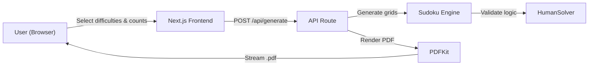
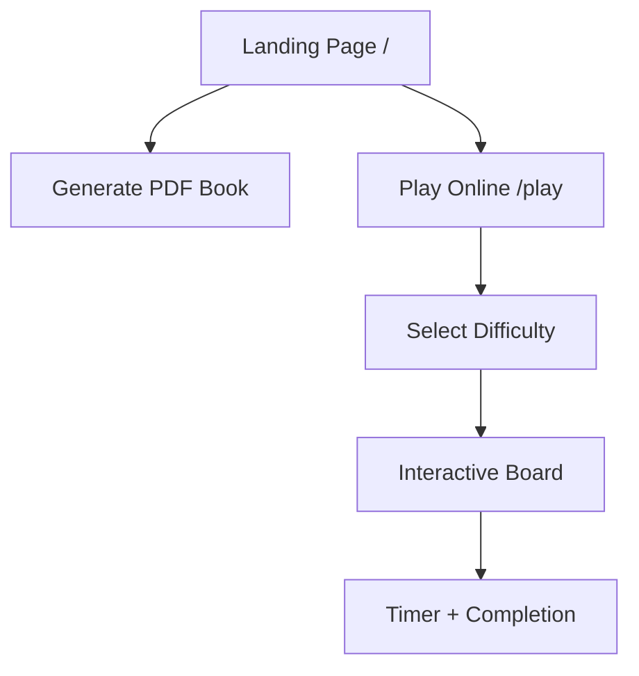
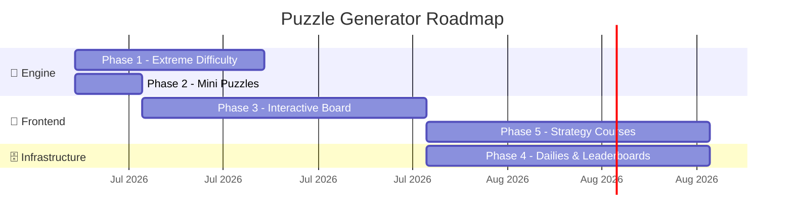
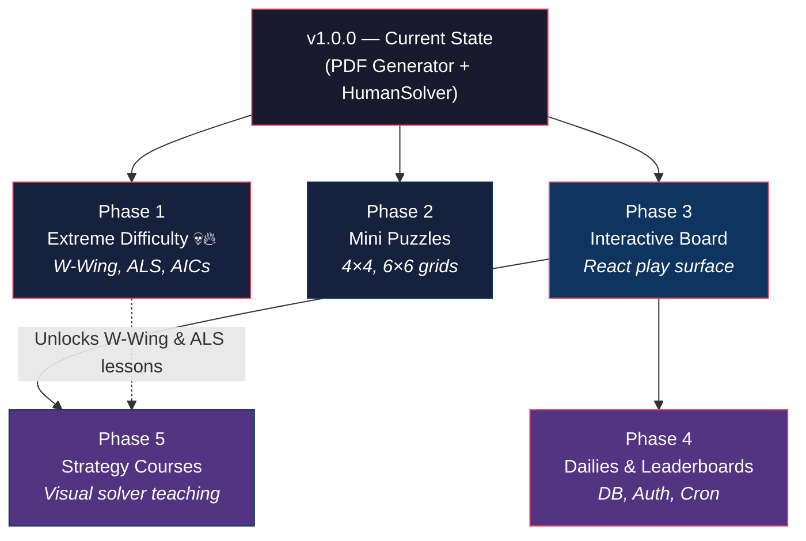

<!-- markdownlint-disable MD013 MD060 -->

# Puzzle Generator — Project Roadmap

> From PDF generator to interactive puzzle platform.

---

## Where We Are Today (v1.0.0)



The app is a **stateless PDF pipeline**. The user picks puzzle counts, the server generates grids, validates them with the `HumanSolver`, renders a PDF, and immediately forgets the interaction. There is no database, no user accounts, and no interactive play.

### What's Built

| Layer | Component | Status |
|---|---|---|
| **Engine** | Backtracking generator + unique-solution validator | ✅ Shipped |
| **Engine** | `HumanSolver` — Naked/Hidden Singles & Pairs, Pointing Pairs, X-Wing, Swordfish, Y-Wing, XYZ-Wing, W-Wing, ALS-XZ, AICs | ✅ Shipped |
| **API** | `/api/generate` — accepts difficulty counts (including extreme), returns PDF stream | ✅ Shipped |
| **Frontend** | `PuzzleForm` — glassmorphism UI with difficulty selectors | ✅ Shipped |
| **PDF** | `generator.ts` — vector grids, bookmarks, internal links, answer keys | ✅ Shipped |
| **Testing** | Jest suite + benchmark scripts with auto-logging | ✅ Shipped |

---

## The Three Tracks

This roadmap is organized into **three parallel tracks** that correspond to the three distinct areas of the codebase. Each phase may touch one or more tracks.

````carousel
### 🧮 Track A — The Math Engine
Expanding the algorithmic solver and generator to support new puzzle types and extreme difficulty levels.

**Key files:**
- [sudoku.ts](file:///c:/Users/user/Documents/BiscuittArcade/Puzzle-Generator/lib/puzzle-engine/sudoku.ts)
- [human-solver.ts](file:///c:/Users/user/Documents/BiscuittArcade/Puzzle-Generator/lib/puzzle-engine/human-solver.ts)
<!-- slide -->
### 🗄️ Track B — Backend Infrastructure
Introducing state, persistence, authentication, and scheduled jobs. Transforming the app from stateless to stateful.

**New dependencies needed:**
- Database (PostgreSQL via Supabase or Vercel Postgres)
- Auth provider (NextAuth / Auth.js)
- Cron scheduler (Vercel Cron or node-cron)
<!-- slide -->
### 🎨 Track C — Frontend Experience
Building interactive play surfaces, visual strategy courses, and real-time competitive features.

**Key files:**
- [page.tsx](file:///c:/Users/user/Documents/BiscuittArcade/Puzzle-Generator/app/page.tsx)
- [PuzzleForm.tsx](file:///c:/Users/user/Documents/BiscuittArcade/Puzzle-Generator/components/PuzzleForm.tsx)
````

---

## Phase 1 — Extreme Difficulty 💀🔥

> **Tracks:** 🧮 Engine
> **Branch:** `feature/extreme-strategies`
> **Status:** ✅ Done
> **Estimated effort:** Large (1–2 weeks)
> **Prerequisite:** None — this is the next step.

This phase is already designed in the [extreme_implementation_plan.md](file:///c:/Users/user/Documents/BiscuittArcade/Puzzle-Generator/Docs/extreme_implementation_plan.md). It extends the `HumanSolver` with three elite-tier strategies and adds a new difficulty level to the entire pipeline.

### Deliverables

#### 1.1 — W-Wing Strategy

- Scan for conjugate pairs across all houses
- Cross-reference with matching bivalue cells bridged by the pair
- Eliminations from cells seeing both bivalue endpoints

#### 1.2 — Almost Locked Sets (ALS-XZ → Full ALS Chains)

- Enumerate ALS groups (N cells, N+1 candidates) per house
- Identify Restricted Common Candidates between ALS pairs
- Extend to full ALS Chains (3+ sets threaded together)

> [!WARNING]
> Combinatorial explosion risk: a 9-cell house has 511 possible subsets. Aggressive pruning (only check subsets where `|candidates| = |cells| + 1`) is **mandatory**.

#### 1.3 — Alternating Inference Chains (AICs)

- Build a full inference graph with strong/weak link edges
- Implement BFS/DFS pathfinding with strict alternation constraints
- Support Grouped AICs (cell clusters as single nodes)
- **Max chain depth: 12–16 nodes** to prevent unbounded search

#### 1.4 — Generator Integration

- New `applyExtremeDigger` function targeting 20–22 clues
- `canHumanSolveExtreme(grid)` validator
- UI: skull emoji label 💀🔥, red warning about 60s generation time
- PDF: new section header in outline for Extreme tier

#### Performance Target

| Metric | Target |
|---|---|
| Average generation time per Extreme puzzle | < 10 seconds |
| Solver speed (AIC-heavy boards) | < 2 seconds |
| Existing Expert regression | 0 — all current tests pass |

---

## Phase 2 — Mini Puzzles (4×4, 6×6)

> **Tracks:** 🧮 Engine, 🎨 Frontend
> **Branch:** `feature/mini-puzzles`
> **Estimated effort:** Medium (3–5 days)
> **Prerequisite:** None — can run in parallel with Phase 1.

This is the **lowest-hanging fruit** for new puzzle variety. The core backtracking and validation logic already works; it just needs to be parameterized.

### Phase 2 Deliverables

#### 2.1 — Parameterized Engine

- Refactor `generateSudoku` to accept dynamic `gridSize` and `boxDimensions`
  - 4×4 grid → 2×2 boxes
  - 6×6 grid → 2×3 boxes
  - 9×9 grid → 3×3 boxes (existing behavior)
- Refactor `HumanSolver` constructor to accept grid dimensions
- Update all hardcoded `9` references to use the parameterized size

#### 2.2 — Difficulty Calibration

- Mini puzzles need their own difficulty curves (a 4×4 with 6 clues is hard; a 4×4 with 4 clues might be impossible)
- Define clue-count ranges per size per difficulty
- Simpler strategies dominate — no need for X-Wing on a 4×4

#### 2.3 — PDF Rendering

- Update `generator.ts` to dynamically draw grids of varying sizes
- Adjust cell sizing, font scaling, and page layout for minis
- Option to fit multiple mini puzzles per page (e.g., 4 × 4×4 grids per page)

#### 2.4 — UI Updates

- Add a "Puzzle Size" selector to `PuzzleForm` (4×4, 6×6, 9×9)
- Conditionally show difficulty options based on grid size

---

## Phase 3 — The Interactive Board

> **Tracks:** 🎨 Frontend, 🗄️ Infrastructure
> **Branch:** `feature/interactive-board`
> **Estimated effort:** Large (2–3 weeks)
> **Prerequisite:** None — but Phase 4 and 5 build on top of this.

This is the **architectural pivot point**. Everything after this phase depends on having a playable, in-browser Sudoku board instead of a PDF-only output.

### Phase 3 Deliverables

#### 3.1 — React Sudoku Board Component

- Full 9×9 interactive grid with keyboard & mouse input
- Candidate pencil-mark mode (toggle per cell)
- Visual highlighting: selected row/column/box, conflicts, locked clues
- Responsive design — works on desktop and tablet
- Smooth micro-animations for number placement and error states

#### 3.2 — Game State Manager

- React context or Zustand store for puzzle state
- Undo/redo stack
- Timer (with pause)
- Completion detection + celebration animation

#### 3.3 — Play Mode vs. PDF Mode

- New route: `/play` for interactive solving
- Existing `/` page continues to offer PDF generation
- Navigation between modes



---

## Phase 4 — Dailies, Users & Leaderboards

> **Tracks:** 🗄️ Infrastructure, 🎨 Frontend
> **Branch:** `feature/daily-leaderboards`
> **Estimated effort:** Large (2–3 weeks)
> **Prerequisite:** Phase 3 (Interactive Board)

This phase introduces **state and persistence**. The app goes from stateless to having a database, user accounts, and scheduled puzzle generation.

### Phase 4 Deliverables

#### 4.1 — Database Layer

- Set up PostgreSQL (Supabase or Vercel Postgres)
- Schema design:

```sql
-- Daily puzzles (one per difficulty per day)
CREATE TABLE daily_puzzles (
  id          UUID PRIMARY KEY DEFAULT gen_random_uuid(),
  date        DATE NOT NULL,
  difficulty  TEXT NOT NULL,
  grid        JSONB NOT NULL,      -- the unsolved puzzle
  solution    JSONB NOT NULL,      -- the solved grid
  clue_count  INT NOT NULL,
  created_at  TIMESTAMPTZ DEFAULT now(),
  UNIQUE(date, difficulty)
);

-- User accounts
CREATE TABLE users (
  id          UUID PRIMARY KEY DEFAULT gen_random_uuid(),
  provider    TEXT NOT NULL,       -- 'google', 'github', etc.
  provider_id TEXT NOT NULL,
  username    TEXT UNIQUE NOT NULL,
  created_at  TIMESTAMPTZ DEFAULT now()
);

-- Solve attempts (speed runs)
CREATE TABLE solve_attempts (
  id          UUID PRIMARY KEY DEFAULT gen_random_uuid(),
  user_id     UUID REFERENCES users(id),
  puzzle_id   UUID REFERENCES daily_puzzles(id),
  time_ms     INT NOT NULL,        -- solve time in milliseconds
  completed   BOOLEAN DEFAULT false,
  created_at  TIMESTAMPTZ DEFAULT now(),
  UNIQUE(user_id, puzzle_id)       -- one attempt per user per puzzle
);
```

#### 4.2 — Daily Puzzle Cron

- Scheduled job runs at midnight UTC
- Generates one puzzle per difficulty level (Easy, Medium, Hard, Expert)
- Stores in `daily_puzzles` table
- All users worldwide get the exact same boards

#### 4.3 — User Authentication

- NextAuth / Auth.js integration
- OAuth providers: Google, GitHub (start with these)
- Session management for tracking solve times
- **Anti-cheat**: solve time validated server-side, puzzle state checksums

> [!IMPORTANT]
> Leaderboard integrity requires server-side time validation. The client sends a start timestamp and the server records completion — never trust a client-reported solve time.

#### 4.4 — Leaderboard UI

- Daily leaderboard per difficulty
- All-time personal bests
- Streak tracking (consecutive daily completions)
- Animated rank reveal after completing a daily

---

## Phase 5 — Interactive Strategy Courses

> **Tracks:** 🎨 Frontend, 🧮 Engine
> **Branch:** `feature/strategy-courses`
> **Estimated effort:** Large (2–3 weeks)
> **Prerequisite:** Phase 3 (Interactive Board)

This is the **crown jewel** — turning the `HumanSolver` into a visual teaching tool. Instead of running silently in the backend, the solver's step-by-step deductions are exposed to the React frontend as an interactive, animated course.

### Phase 5 Deliverables

#### 5.1 — Solver Step Serialization

- Refactor `HumanSolver.solve()` to emit a `SolveStep[]` array:

```typescript
type SolveStep = {
  strategy: string;              // 'Naked Single', 'X-Wing', etc.
  description: string;           // Human-readable explanation
  highlights: {
    cells: Cell[];               // Cells involved in the pattern
    color: 'primary' | 'danger' | 'success';
  }[];
  eliminations: {
    cell: Cell;
    candidate: number;
  }[];
  placements: {
    cell: Cell;
    value: number;
  }[];
};
```

#### 5.2 — Course Player Component

- Step-through UI: "Previous / Next / Auto-Play" controls
- Board state updates one step at a time
- Highlighted cells pulse/glow to show the pattern being explained
- Sidebar panel with the strategy name and plain-English explanation
- Speed slider for auto-play mode

#### 5.3 — Curated Lesson Library

- Pre-built puzzle boards that specifically require each strategy:
  - Lesson 1: Naked Singles & Hidden Singles
  - Lesson 2: Naked Pairs & Pointing Pairs
  - Lesson 3: X-Wing & Swordfish
  - Lesson 4: Y-Wing & XYZ-Wing
  - Lesson 5: W-Wing (after Phase 1)
  - Lesson 6: Almost Locked Sets (after Phase 1)
- Each lesson has a "Try It Yourself" mode where the board pauses and lets the user attempt the deduction before revealing the answer

---

## Phase Map



> [!NOTE]
> Phases 1 and 2 can run **in parallel** since they touch different parts of the engine. Phases 4 and 5 can also run in parallel since they depend on Phase 3 but not on each other.

---

## Dependency Graph



---

## Future Horizons (Beyond Phase 5)

These ideas are explicitly **out of scope** for the roadmap above but are worth documenting as north stars:

### Killer Sudoku & KenKen

A **massive algorithmic leap** requiring an entirely new constraint system. Killer Sudoku introduces "cages" (irregularly shaped regions with sum constraints and no-repeat rules). KenKen adds mathematical operators (÷, ×, −, +) into constraint checks. This effectively requires writing a brand-new generation and solving engine — not an extension of the current one.

> [!CAUTION]
> This is not a refactor. Killer Sudoku and KenKen are fundamentally different puzzle types that share a visual resemblance to Sudoku but have distinct constraint satisfaction models. Plan for a new module (`lib/puzzle-engine/killer-sudoku.ts`) rather than trying to shoehorn it into the existing `sudoku.ts`.

### Multiplayer Speed Races

Real-time WebSocket-based head-to-head solving. Two players get the same board and race to solve it first with a live progress indicator showing the opponent's completion percentage.

### Mobile App (React Native)

Port the interactive board and daily puzzles to a native mobile experience.

### Community Puzzle Sharing

User-generated puzzles with a rating system — players can create, share, and rate puzzles.

---

## Open Questions

> [!IMPORTANT]
> **Database provider:** Supabase vs. Vercel Postgres vs. PlanetScale? This decision affects Phase 4's auth integration and hosting architecture.
>
> [!IMPORTANT]
> **Phase 3 scope:** Should the Interactive Board support all grid sizes (4×4, 6×6, 9×9) from the start, or ship with 9×9 only and add mini-board support later?
>
> [!IMPORTANT]
> **Killer Sudoku timing:** Should we begin research on the cage-constraint engine during Phase 1, or defer all Killer/KenKen work until after Phase 5?
